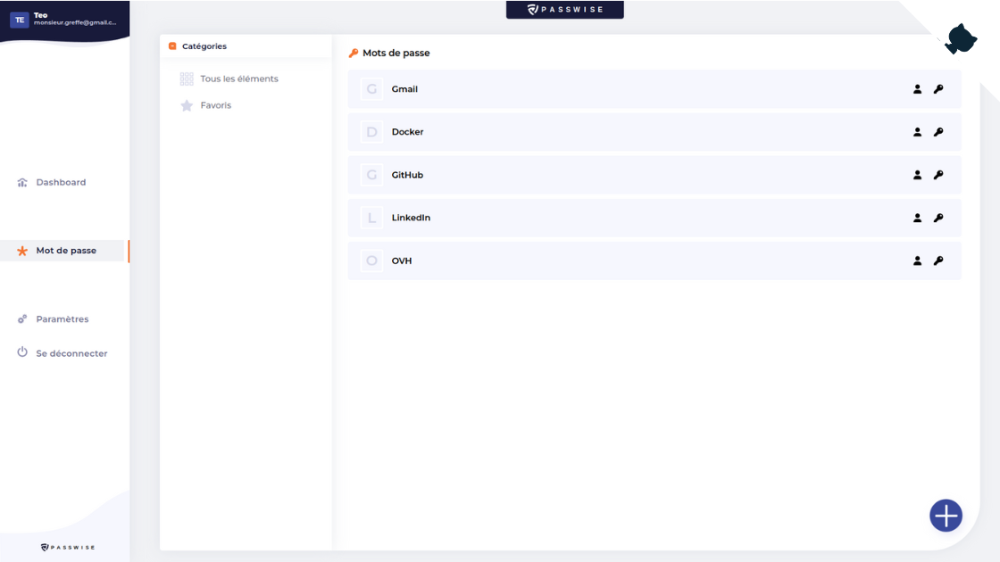

<div align="center">
  
  <h1>Passwise - Password Manager</h1>
  
  

  <p>
    <a href="https://codeclimate.com/github/tristan-greffe/passwise/coverage">
      
    </a>
    <a href="https://codeclimate.com/github/tristan-greffe/passwise">
      
    </a>
    <a href="https://github.com/tristan-greffe/passwise/stargazers">
      
    </a>
    <a href="https://github.com/tristan-greffe/passwise/blob/master/LICENSE">
      
    </a>
  </p>

 <h4>
    <a href="https://github.com/tristan-greffe/passwise/issues/">Report Bug</a>
    <span> · </span>
    <a href="https://github.com/tristan-greffe/passwise/issues/">Request Feature</a>
  </h4>

</div>

## About the Project

<div align="center">
  
</div>

**Open source password manager**, based on the **[FeathersJS](https://feathersjs.com/)** & **[ReactJS](https://react.dev/)** frameworks.

### Tech Stack

[](https://skillicons.dev)

## Getting Started

### Installing

#### Step 1: set the required environment variables

| ENV | Description | Required |
|---|---|---|
| `GMAIL_USER` | Email used for gmail account | yes |
| `GMAIL_PASWORD` |  Password for gmail account | yes |
| `GOOGLE_CLIENT_ID` | Customer ID for google authentication | no |
| `GOOGLE_CLIENT_SECRET` | Customer secret key for google authentication | no |

#### Step 2: installing

```sh
git clone https://github.com/tristan-greffe/passwise.git

// Run the server/API
cd passwise/api
yarn install
yarn dev

// In another terminal run the client app
cd passwise
yarn install
yarn dev
```

## Contributing

Contributions are always welcome!

Contributions are what make the open source community such an amazing place to learn, inspire, and create. Any contributions you make are **greatly appreciated**.

If you have a suggestion that would make this better, please fork the repo and create a pull request. You can also simply open an issue with the tag "enhancement".
Don't forget to give the project a star! Thanks again!

1. Fork it! 🤙

2. Create your feature branch: `git checkout -b my-new-feature`

3. Commit your changes: `git commit -m "Add some feature"`

4. Push to the branch: `git push origin my-new-feature`

5. Submit a pull request 👍

## License

This project is licensed under the MIT License - see the [license file](./LICENSE) for details
